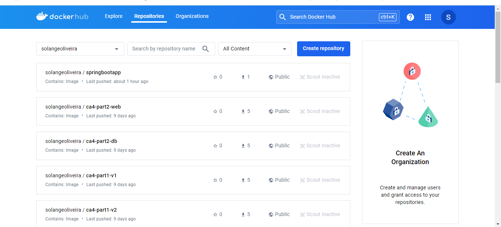

# Class Assignment 5 (CA5)

## Introduction

The objective of this assignment is to gain practical experience with Jenkins, a leading automation server widely used for continuous integration (CI) and continuous delivery (CD) pipelines. This assignment focuses on leveraging Jenkins to automate the build process of a tutorial Spring Boot application using the 'basic' Gradle version (as developed in CA2, Part 2).

Jenkins allows teams to automate tasks such as building, testing, and deploying software applications, thereby streamlining the development lifecycle. Key to this automation is the concept of pipelines, which are workflows that define how software is built, tested, and deployed. These pipelines are defined and configured using a script stored in a file named Jenkinsfile. The Jenkinsfile serves as the blueprint for the pipeline, outlining the sequence of stages and steps that Jenkins will execute.

In this assignment, we will explore the power of Jenkins by creating two distinct pipelines, each designed with specific objectives in mind.
 
## Outline

1. [Install Jenkins](#Install-Jenkins)
2. [Set up a pipeline in Jenkins](#Set-up-a-pipeline-in-Jenkins)
3. [Set up a second pipeline in Jenkins](#Set-up-a-second-pipeline-in-Jenkins)
4. [Challenges](#Challenges)
4. [Conclusion](Conclusion)


## Install Jenkins
**1.** Using a Docker Container you have to execute the following command in a terminal/console:

```bash
docker run -d -p 8080:8080 -p 50000:50000 -v jenkins-data:/var/jenkins_home --name=jenkins jenkins/jenkins:lts-jdk17
```

This command starts a Docker container running an instance of Jenkins, with ports 8080 and 50000 mapped to the host, and a persistent volume to retain Jenkins data.

Note: To access Jenkins after executing this command, you must have Docker open and running (for Jenkins to function properly with pipelines involving Docker).

**2.** After running you should open a browser and going to the following URL http://localhost:8080 to access Jenkins.

Jenkins is now running and we can start creating the pipeline.

**3.** Execute any necessary additional setup steps, such as configuring the account and password.

**4.** Install the suggested plugins.

**5.** To add credentials for Docker Hub and Git in Jenkins, navigate to "Manage Jenkins," then "Manage Credentials." Select "Jenkins," proceed to "Global credentials," and click on "Add Credentials." Here, you can add the Docker Hub and Git credentials.


## Set up a pipeline in Jenkins

Now we can start creating a simple pipeline and its respective Jenkinsfile.

**1.** Create a Jenkinsfile in the CA5 folder and commit it to your repository.
   It must have the following structure:
    
```groovy
pipeline {
	agent any
	stages {
		stage('Checkout') {
			steps {
				echo 'Checking out...'
				git branch: 'master', url: 'https://github.com/Solange-o/devops-23-24-JPE-1212208.git'
				}
			}
		stage('Assemble') {
			steps {
				echo 'Building...'
				dir('CA2/Part1') {
				sh 'chmod +x ./gradlew'
				sh './gradlew assemble'
				}
                            }
			}
		stage('Test') {
			steps {
				echo 'Building...'
				dir('CA2/Part1'){
				sh './gradlew test'
				junit '**/build/test-results/test/*.xml'
				}
                            }
			}
		stage('Archive') {
			steps {
				echo 'Archiving...'
				dir('CA2/Part1'){
				archiveArtifacts 'build/libs/*.jar'
				}
		    }
		}
	}
}
```

**Notes:**
This pipeline covers the basic CI/CD flow, including obtaining the source code, building, testing, and archiving the resulting artefacts. 
Here is a brief description of what each stage of the pipeline does.

_Checkout:_
Displays a message "Checking out...".
Checks out the source code from the specified Git repository (https://github.com/Solange-o/devops-23-24-JPE-1212208.git) on the master branch.

_Assemble:_
Displays a message "Building...".
Changes the directory to CA2/Part1.
Grants execution permission to the gradlew script.
Executes the command ./gradlew assemble to build the project.

_Test:_
Displays a message "Building...".
Changes the directory to CA2/Part1.
Executes the command ./gradlew test to run the project tests.
Publishes the test results in JUnit format, stored in XML files within the directory **/build/test-results/test/*.xml.

_Archive:_
Displays a message "Archiving...".
Changes the directory to CA2/Part1.
Archives the artefacts generated by the build, specifically the JAR files located in build/libs/*.jar.


**2.** From the main page of Jenkins select ”New Item”. Enter the item name. After select ”Pipeline”.
You should now see the configuration page of the Job.

**3.** In the Definition field, select the option 'pipeline script from SCM'.
  When selecting this option, you are indicating that the pipeline script will be retrieved from a source code management (SCM) repository, such as Git. Jenkins will fetch the pipeline script from the specified repository and execute it. This allows the pipeline script to be versioned and managed like any other code, which is beneficial for continuous integration (CI) and continuous delivery (CD) practices.

**4.** In the next form fields you must:
 - Select Git; 
 - Identify the repository and credentials.
 - Select your branch.
 - Specify the Jenkinsfile path.

**5.** In the script box enter the contents of the Jenkinsfile.

**6.** Click in save.

**7.** After creating the pipeline, you can use 'Build Now' to execute the job and check if it is working correctly.

**8.** We can see the pipeline on the Jenkins dashboard:


## Set up a second pipeline in Jenkins

**1.** Create a Jenkinsfile in the CA5 folder (with other name) and commit it to your repository.
   The second Jenkinsfile is similar to the first one, but it has an extra stage that pushes the Docker image to Dockerhub.
   This Jenkinsfile should have the following content:

```groovy
pipeline {
    agent any

    environment {
        DOCKER_CREDENTIALS_ID = 'ddf07269-a908-4586-a413-9e1bf353a583'
        DOCKER_IMAGE = 'solangeoliveira/springbootapp'
        DOCKER_TAG = "${env.BUILD_ID}"
    }

    stages {
        stage('Checkout') {
            steps {
                echo 'Checking out the code...'
                git credentialsId: '5de2daa1-ee45-4e1e-bf67-2bd05b430e09', url: 'https://github.com/Solange-o/devops-23-24-JPE-1212208.git'
            }
        }
        
        stage('Set Permissions') {
            steps {
                dir('CA2/Part2/') {
                    echo 'Setting executable permissions on gradlew...'
                    bat 'gradlew.bat'
                }
            }
        }
        
        stage('Assemble') {
            steps {
                dir('CA2/Part2/') {
                    echo 'Assembling the application...'
                    bat './gradlew.bat assemble'
                }
            }
        }
        
        stage('Test') {
            steps {
                dir('CA2/Part2/') {
                    echo 'Running unit tests...'
                    bat './gradlew.bat test'
                }
            }
        }
        
        stage('Javadoc') {
            steps {
                dir('CA2/Part2/') {
                    echo 'Generating Javadoc...'
                    bat './gradlew.bat javadoc'
                    publishHTML(target: [
                        allowMissing: false,
                        alwaysLinkToLastBuild: false,
                        keepAll: true,
                        reportDir: 'build/docs/javadoc',
                        reportFiles: 'index.html',
                        reportName: 'Javadoc'
                    ])
                }
            }
        }
        
        stage('Archive') {
            steps {
                dir('CA2/Part2/') {
                    echo 'Archiving artifacts...'
                    archiveArtifacts artifacts: 'build/libs/*.jar', fingerprint: true
                }
            }
        }
        
        stage('Create Dockerfile') {
            steps {
                dir('CA2/Part2/') {
                    script {
                        def dockerfileContent = """
                        FROM openjdk:11-jre-slim
                        WORKDIR /app
                        COPY build/libs/*.jar app.jar
                        EXPOSE 8080
                        ENTRYPOINT ["java", "-jar", "app.jar"]
                        """
                        writeFile file: 'Dockerfile', text: dockerfileContent
                    }
                }
            }
        }
        
        stage('Publish Image') {
            steps {
                script {
                    echo 'Building and publishing Docker image...'
                    docker.withRegistry('https://index.docker.io/v1/', "${DOCKER_CREDENTIALS_ID}") {
                        dir('CA2/Part2/') {
                            def customImage = docker.build("${DOCKER_IMAGE}:${DOCKER_TAG}")
                            customImage.push()
                            customImage.push('latest')
                        }
                    }
                }
            }
        }
    }
}
```

**Notes:**
This script defines a Jenkins pipeline for building, testing, documenting, archiving, and publishing a Spring Boot application as a Docker image. Here is a brief description of what each stage of the pipeline does:

_Checkout:_
Displays a message "Checking out the code...".
Checks out the source code from the specified Git repository using the provided credentials.

_Set Permissions:_
Changes the directory to CA2/Part2/.
Displays a message "Setting executable permissions on gradlew...".
Sets executable permissions on the gradlew.bat script.

_Assemble:_
Changes the directory to CA2/Part2/.
Displays a message "Assembling the application...".
Runs the command ./gradlew.bat assemble to build the project.

_Test:_
Changes the directory to CA2/Part2/.
Displays a message "Running unit tests...".
Runs the command ./gradlew.bat test to execute the project's unit tests.

_Javadoc:_
Changes the directory to CA2/Part2/.
Displays a message "Generating Javadoc...".
Runs the command ./gradlew.bat javadoc to generate the Javadoc documentation.
Publishes the generated documentation as an HTML report in Jenkins.

_Archive:_
Changes the directory to CA2/Part2/.
Displays a message "Archiving artefacts...".
Archives the artefacts generated by the project build, specifically the JAR files located in build/libs/*.jar, with fingerprinting.

_Create Dockerfile:_
Changes the directory to CA2/Part2/.
Creates a Dockerfile with the specified content, setting up a Docker image to run the Java application.

_Publish Image:_
Displays a message "Building and publishing Docker image...".
Uses Docker credentials to authenticate with the Docker registry.
Changes the directory to CA2/Part2/.
Builds the Docker image from the Dockerfile and publishes the image with two tags: the build-specific tag (${DOCKER_TAG}) and the latest tag.


**2.** Install additional plugins in Jenkins such as Docker Pipeline and HTML Pulblisher plugin.
    To accomplish this, navigate to 'Manage Jenkins', then to 'Manage Plugins', and select the 'Available' tab. Locate the desired plugins, choose them, and click 'Install without restart'.

**3.** From the main page of Jenkins select ”New Item”. Enter the item name. After select ”Pipeline”.

**4.** In the Definition field, select the option 'pipeline script from SCM'.

**5.** In the next form fields you must:
 - Select Git; 
 - Identify the repository and credentials.
 - Select your branch.
 - Specify the Jenkinsfile path.

**6.** In the script box enter the contents of this last Jenkinsfile (present in last step 1).

**7.** Click in save.

**8.** After creating the pipeline, you can use 'Build Now' to execute the job and check if it is working correctly.

**9.** We can see the pipeline on the Jenkins dashboard:


**10.** After Building and publishing Docker image it  can be seen in the Docker Hub.
    

    
**11.** Check the docker desktop for the container running.


## Challenges

When working with Jenkins and pipelines, you may encounter several challenges. It is crucial to adopt a systematic and methodological approach, leveraging Jenkins' advanced functionalities and available plugins to enhance the efficiency and reliability of your CI/CD pipelines.
Here are some issues you may face when setting up and running pipelines in Jenkins, along with suggestions on how to resolve them:

**Jenkinsfile Configuration Errors:**
Syntax or logic errors in the Jenkinsfile can cause pipeline execution failures.
Carefully check the Jenkinsfile for syntax errors such as missing commas, incorrectly closed brackets, or invalid Groovy commands. Test the Jenkinsfile locally before submitting it to Jenkins.

**Authentication and Authorization Issues:**
Failures to access Git repositories, build systems, or other resources due to authentication or permissions problems may occur.
Ensure that necessary credentials are securely and properly configured in Jenkins. Verify access permissions to resources (e.g., Git repositories) to ensure Jenkins has the necessary privileges to perform tasks.

**Dependencies and Execution Environments:**
Missing dependencies or incompatible software versions can lead to pipeline step failures.
Use Docker to create isolated and reproducible execution environments for your application. Ensure all required dependencies and versions are correctly specified in the pipeline execution environment.

**Error Management and Recovery:**
Unexpected failures during pipeline execution without clear recovery or notification mechanisms may occur.
To address this, implement robust error handling within the Jenkinsfile, including rollback steps and failure notifications. Utilize Jenkins plugins such as Pipeline Utility Steps to effectively manage exceptions and recover from failures.

**Monitoring and Visibility:**
Lack of visibility into the status and progress of running pipelines may be an issue.
Configure monitoring dashboards and panels in Jenkins to visualize real-time pipeline status. Use plugins like Blue Ocean for a more intuitive graphical interface and advanced pipeline visualization.


## Conclusion
In this assignment, we have successfully practiced creating and managing Jenkins pipelines to build a Spring Boot application using Gradle. By following the outlined steps, we were able to:
1- Install Jenkins: We set up Jenkins using a Docker container, ensuring it was accessible through our browser.
2- Create and Configure Jenkinsfiles: We created two Jenkinsfiles. The first one defined a basic pipeline that checked out the code, built the application, ran tests, and archived the build artifacts. The second Jenkinsfile extended this pipeline by adding stages to generate Javadoc and to create and push a Docker image to Dockerhub.

Through these tasks, we have gained practical experience in:
Setting up Jenkins and creating jobs.
Writing and configuring Jenkinsfiles to automate build, test, and deployment processes.
Using Jenkins to integrate with Docker for continuous integration and continuous delivery (CI/CD).
This assignment has solidified our understanding of Jenkins pipelines, preparing us for more complex CI/CD workflows in real-world projects. We now have a foundational skill set to automate the building, testing, and deployment of applications, which is essential for efficient and reliable software development and delivery.
