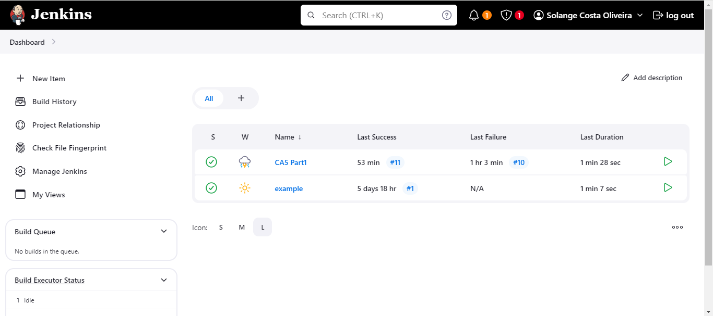
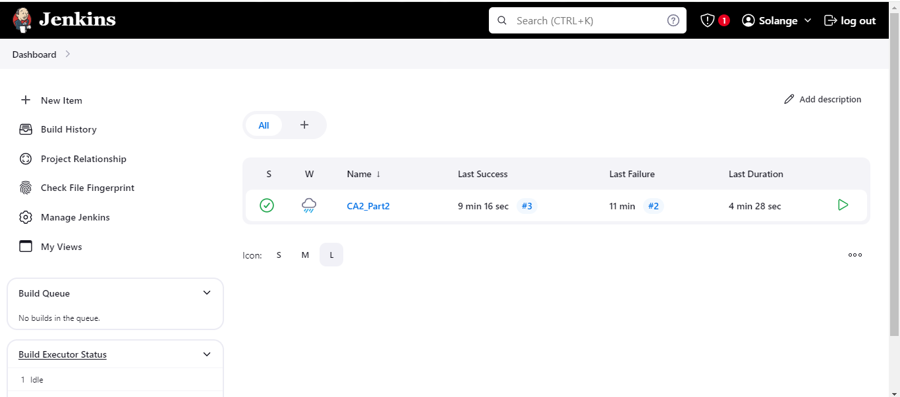

# Class Assignment 5 (CA5)

## Introduction

The goal of this assignment is to practice with Jenkins like create a pipeline to build the tutorial spring boot application, gradle ”basic”
version (developed in CA2, Part2).
 
## Outline

1. [Install Jenkins](#Install-Jenkins)
2. [Create first Jenkinsfile](#Create-first-Jenkinsfile)
3. [Create second Jenkinsfile](#Create-second-Jenkinsfile)
4. [Conclusion](Conclusion)


## Install Jenkins
1. Using a Docker Container you have to execute the following command in a terminal/console:

```bash
docker run -d -p 8080:8080 -p 50000:50000 -v jenkins-data:/var/jenkins_home --name=jenkins jenkins/jenkins:lts-jdk17
```

2. After running you should open a browser and going to the following URL http://localhost:8080 to access Jenkins.

Jenkins is now running and we can start creating the pipeline. To do this we can follow the pdf provided by the teacher.

3. Execute any necessary additional setup step.

## Create Jenkinsfile

Now we can start creating the Jenkinsfile. By convention the script of the pipeline is stored on files named Jenkinsfile. 
The Jenkinsfile is responsible for defining the pipeline and the steps that the pipeline will execute.

1. From the main page of Jenkins select ”New Item”. After select ”Pipeline”.
You should now see the configuration page of the Job.

2. In the Definition field, select the option 'pipeline script from SCM'.
  When selecting this option, you are indicating that the pipeline script will be retrieved from a source code management (SCM) repository, such as Git. Jenkins will fetch the pipeline script from the specified repository and execute it. This allows the pipeline script to be versioned and managed like any other code, which is beneficial for continuous integration (CI) and continuous delivery (CD) practices.

3. In the script box enter the next code:

```groovy
pipeline {
	agent any
	stages {
		stage('Checkout') {
			steps {
				echo 'Checking out...'
				git branch: 'master', url: 'https://github.com/Solange-o/devops-23-24-JPE-1212208.git'
				}
			}
		stage('Assemble') {
			steps {
				echo 'Building...'
				dir('CA2/Part1') {
				sh 'chmod +x ./gradlew'
				sh './gradlew assemble'
				}
                            }
			}
		stage('Test') {
			steps {
				echo 'Building...'
				dir('CA2/Part1'){
				sh './gradlew test'
				junit '**/build/test-results/test/*.xml'
				}
                            }
			}
		stage('Archive') {
			steps {
				echo 'Archiving...'
				dir('CA2/Part1'){
				archiveArtifacts 'build/libs/*.jar'
				}
		    }
		}
	}
}
```
This pipeline covers the basic CI/CD flow, including obtaining the source code, building, testing, and archiving the resulting artefacts. 
Here is a brief description of what each stage of the pipeline does:

Checkout:
Displays a message "Checking out...".
Checks out the source code from the specified Git repository (https://github.com/Solange-o/devops-23-24-JPE-1212208.git) on the master branch.

Assemble:
Displays a message "Building...".
Changes the directory to CA2/Part1.
Grants execution permission to the gradlew script.
Executes the command ./gradlew assemble to build the project.

Test:
Displays a message "Building...".
Changes the directory to CA2/Part1.
Executes the command ./gradlew test to run the project tests.
Publishes the test results in JUnit format, stored in XML files within the directory **/build/test-results/test/*.xml.

Archive:
Displays a message "Archiving...".
Changes the directory to CA2/Part1.
Archives the artefacts generated by the build, specifically the JAR files located in build/libs/*.jar.

4. Click in save.

5. After creating the pipeline, you can use 'Build Now' to execute the job and check if it is working correctly.

6. We can see the pipeline on the Jenkins dashboard:

    


## Create second Jenkinsfile

The second Jenkinsfile is similar to the first one, but it has an extra stage that pushes the Docker image to Dockerhub.

1. Follow the previous steps 1 and 2.

2. This Jenkinsfile should have the following content:

```groovy
pipeline {
    agent any

    environment {
        DOCKER_CREDENTIALS_ID = 'ddf07269-a908-4586-a413-9e1bf353a583'
        DOCKER_IMAGE = 'solangeoliveira/springbootapp'
        DOCKER_TAG = "${env.BUILD_ID}"
    }

    stages {
        stage('Checkout') {
            steps {
                echo 'Checking out the code...'
                git credentialsId: '5de2daa1-ee45-4e1e-bf67-2bd05b430e09', url: 'https://github.com/Solange-o/devops-23-24-JPE-1212208.git'
            }
        }
        
        stage('Set Permissions') {
            steps {
                dir('CA2/Part2/') {
                    echo 'Setting executable permissions on gradlew...'
                    bat 'gradlew.bat'
                }
            }
        }
        
        stage('Assemble') {
            steps {
                dir('CA2/Part2/') {
                    echo 'Assembling the application...'
                    bat './gradlew.bat assemble'
                }
            }
        }
        
        stage('Test') {
            steps {
                dir('CA2/Part2/') {
                    echo 'Running unit tests...'
                    bat './gradlew.bat test'
                }
            }
        }
        
        stage('Javadoc') {
            steps {
                dir('CA2/Part2/') {
                    echo 'Generating Javadoc...'
                    bat './gradlew.bat javadoc'
                    publishHTML(target: [
                        allowMissing: false,
                        alwaysLinkToLastBuild: false,
                        keepAll: true,
                        reportDir: 'build/docs/javadoc',
                        reportFiles: 'index.html',
                        reportName: 'Javadoc'
                    ])
                }
            }
        }
        
        stage('Archive') {
            steps {
                dir('CA2/Part2/') {
                    echo 'Archiving artifacts...'
                    archiveArtifacts artifacts: 'build/libs/*.jar', fingerprint: true
                }
            }
        }
        
        stage('Create Dockerfile') {
            steps {
                dir('CA2/Part2/') {
                    script {
                        def dockerfileContent = """
                        FROM openjdk:11-jre-slim
                        WORKDIR /app
                        COPY build/libs/*.jar app.jar
                        EXPOSE 8080
                        ENTRYPOINT ["java", "-jar", "app.jar"]
                        """
                        writeFile file: 'Dockerfile', text: dockerfileContent
                    }
                }
            }
        }
        
        stage('Publish Image') {
            steps {
                script {
                    echo 'Building and publishing Docker image...'
                    docker.withRegistry('https://index.docker.io/v1/', "${DOCKER_CREDENTIALS_ID}") {
                        dir('CA2/Part2/') {
                            def customImage = docker.build("${DOCKER_IMAGE}:${DOCKER_TAG}")
                            customImage.push()
                            customImage.push('latest')
                        }
                    }
                }
            }
        }
    }
}
```

This script defines a Jenkins pipeline for building, testing, documenting, archiving, and publishing a Spring Boot application as a Docker image. Here is a brief description of what each stage of the pipeline does:

Checkout:
Displays a message "Checking out the code...".
Checks out the source code from the specified Git repository using the provided credentials.

Set Permissions:
Changes the directory to CA2/Part2/.
Displays a message "Setting executable permissions on gradlew...".
Sets executable permissions on the gradlew.bat script.

Assemble:
Changes the directory to CA2/Part2/.
Displays a message "Assembling the application...".
Runs the command ./gradlew.bat assemble to build the project.

Test:
Changes the directory to CA2/Part2/.
Displays a message "Running unit tests...".
Runs the command ./gradlew.bat test to execute the project's unit tests.

Javadoc:
Changes the directory to CA2/Part2/.
Displays a message "Generating Javadoc...".
Runs the command ./gradlew.bat javadoc to generate the Javadoc documentation.
Publishes the generated documentation as an HTML report in Jenkins.

Archive:
Changes the directory to CA2/Part2/.
Displays a message "Archiving artefacts...".
Archives the artefacts generated by the project build, specifically the JAR files located in build/libs/*.jar, with fingerprinting.

Create Dockerfile:
Changes the directory to CA2/Part2/.
Creates a Dockerfile with the specified content, setting up a Docker image to run the Java application.

Publish Image:
Displays a message "Building and publishing Docker image...".
Uses Docker credentials to authenticate with the Docker registry.
Changes the directory to CA2/Part2/.
Builds the Docker image from the Dockerfile and publishes the image with two tags: the build-specific tag (${DOCKER_TAG}) and the latest tag.

3. Click in save.

4. After creating the pipeline, you can use 'Build Now' to execute the job and check if it is working correctly.

5. We can see the pipeline on the Jenkins dashboard:

    


## Conclusion
In this assignment, we have successfully practiced creating and managing Jenkins pipelines to build a Spring Boot application using Gradle. By following the outlined steps, we were able to:
1- Install Jenkins: We set up Jenkins using a Docker container, ensuring it was accessible through our browser.
2- Create and Configure Jenkinsfiles: We created two Jenkinsfiles. The first one defined a basic pipeline that checked out the code, built the application, ran tests, and archived the build artifacts. The second Jenkinsfile extended this pipeline by adding stages to generate Javadoc and to create and push a Docker image to Dockerhub.

Through these tasks, we have gained practical experience in:
Setting up Jenkins and creating jobs.
Writing and configuring Jenkinsfiles to automate build, test, and deployment processes.
Using Jenkins to integrate with Docker for continuous integration and continuous delivery (CI/CD).
This assignment has solidified our understanding of Jenkins pipelines, preparing us for more complex CI/CD workflows in real-world projects. We now have a foundational skill set to automate the building, testing, and deployment of applications, which is essential for efficient and reliable software development and delivery.
